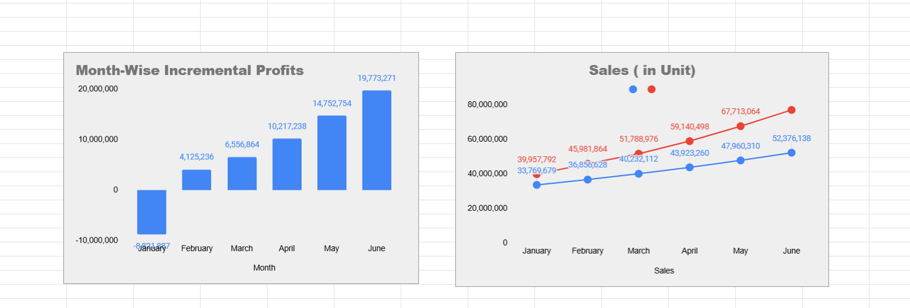

# 📊 IPL Co-Branding Cost–Benefit Analysis — PowerSip & HappyGrow

This repository contains a complete financial impact assessment of **PureVibe Co.’s IPL-themed marketing campaign** for PowerSip (300 ml) and HappyGrow (200 ml).  
The study evaluates sales, raw material usage, contribution margins, and incremental profitability across **January–June**, covering four cities: **Chennai, Mumbai, Bengaluru, and Delhi**.

---

## 🖼 Dashboard Preview

<p align="center">
  
</p>

---

## 📁 Repository Structure

```bash
purevibe-ipl-cba/
├── Case Study/
│ └── PureVibe_Case_Study.pdf
├── Dashboard/
│ ├── index.html
│ └── dashboard-preview.png
├── Data/
│ └── <Sales & raw material data files>
├── Report/
│ └── Financial Impact Assessment of IPL-Themed Packaging.pdf
└── README.md
```

---

## 📌 Executive Summary

### ✔ Net Financial Impact: **+ ₹46.60 Million**  
### ✔ Incremental Contribution: **₹86.61 Million**  
### ✔ Total Incremental Costs: **₹40.01 Million**  
### ✔ Recommendation: **Proceed — campaign is profitable**

The IPL strategy delivers strong ROI driven by increased demand, improved pricing, and higher brand visibility.

---

## 📈 Key Insights

### **1. Contribution Margin Growth**
Contribution increased from **₹255.1M → ₹341.7M**, a net gain of **₹86.6M**.

### **2. Cost Breakdown**
- ₹30M incremental advertising  
- ₹10M ad preparation  
- ₹10k packaging redesign  

### **3. Raw Material Efficiency**
Material usage scaled proportionally with increased sales — confirming operational efficiency.

### **4. City-Wise Performance**
Bengaluru and Chennai showed the fastest sales acceleration.

---

## 🧮 Methodology

### **Phase 1 — Data Cleaning (ETL)**
Structured raw text into analyzable rows (Month, Region, City, Product, Old/New Quantity).

### **Phase 2 — Financial Modeling**
Calculated:
- Revenue (Old vs New Plan)
- Variable Costs
- Contribution per month

### **Phase 3 — Cost–Benefit Analysis**
Final Incremental Profit = Incremental Contribution – Incremental Costs


---

## 🖥 Interactive Dashboard (HTML)

The dashboard is available in:

Dashboard/index.html


Features:
- Contribution comparison chart  
- Cost breakdown donut chart  
- Summary KPIs  
- Clean UI with TailwindCSS  
- Chart.js visualizations  

To deploy via GitHub Pages:

1. Go to **Settings → Pages**  
2. Select branch: `main`  
3. Folder: `/Dashboard`  
4. Save  
5. Open your published link

---

## 🛠 Tools Used
- Google Sheets  
- Excel / CSV  
- Chart.js  
- TailwindCSS  
- HTML / JavaScript  
- Financial Modeling  

---

## 👤 Author
**Tanmay**  
Data Analyst | CSE Graduate | Financial Modeling & Dashboard Development

## 🔗 Live Dashboard

The interactive financial impact dashboard is now live and accessible here:

👉 **https://tan629-d3v.github.io/Financial-Impact-Assessment-of-IPL-Themed-Packaging-Strategy/**

This interactive site includes:
- Dynamic KPI cards  
- Contribution margin comparison (Old vs New Plan)  
- Incremental cost breakdown (ads, prep, design)  
- Fully responsive dashboard built using HTML, TailwindCSS, and Chart.js  

You can explore the complete financial story behind PureVibe's IPL co-branding strategy directly through the web interface.


---

## 📧 Contact
- LinkedIn: *https://www.linkedin.com/in/tanmay19/*  
- GitHub: *https://github.com/Tan629-D3V*  

